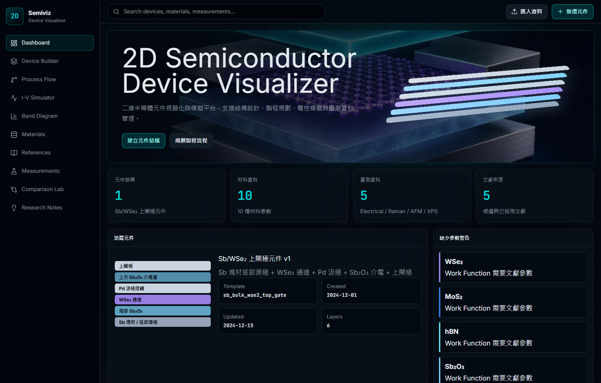
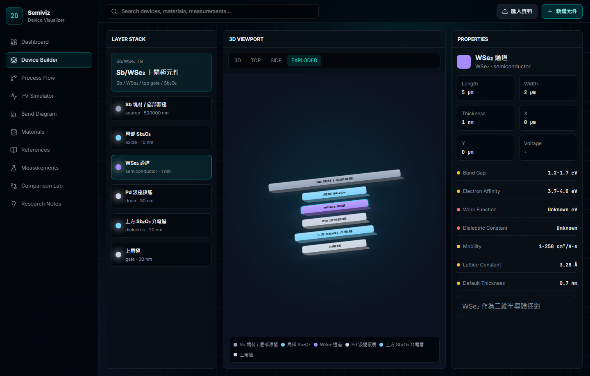
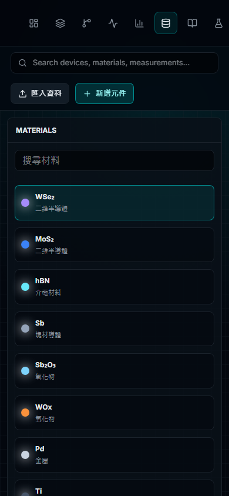

# 2D Semiconductor Device Visualizer

二維半導體元件視覺化與模擬平台。這個 repo 目前已依照設計系統文件重建成固定深色主題的 Lithograph 微影蝕刻美學介面，支援結構設計、製程規劃、電性模擬、能帶圖、材料資料庫、文獻管理、量測資料與研究假說追蹤。



## Tech Stack

- React 19 + TypeScript + Vite
- Tailwind CSS 4
- React Three Fiber + Drei + Three.js
- Recharts
- Wouter
- Lucide React
- Playwright for visual QA

## Current App Surface

| Route | Page | Status |
| --- | --- | --- |
| `/` | Dashboard | Hero, stats, active device, missing parameter warnings, recent work overview |
| `/device-builder` | Device Builder | 3-column layer stack, viewport, properties panel, 3D/exploded controls |
| `/process-flow` | Process Flow | 12-step process timeline, step selector, parameter inspector |
| `/iv-simulator` | I-V Simulator | Interactive mobility/Vth controls, transfer/output curves |
| `/band-diagram` | Band Diagram | Metal selector, before/after contact mode, Schottky barrier summaries |
| `/materials` | Materials | Searchable material database with confidence indicators |
| `/references` | References | Literature list, review status, reliability score |
| `/measurements` | Measurements | Measurement metadata and signal preview |
| `/comparison-lab` | Comparison Lab | WSe2, MoS2, Pd, Ti comparison table |
| `/research-notes` | Research Notes | Hypothesis tracking and linked research context |

## Design System

The UI follows a fixed dark-mode Lithograph direction:

- deep blue-black scientific workspace
- cyan primary actions and selected states
- dense instrument-panel layout inspired by SEM/AFM control surfaces
- OKLCH color tokens for background, card, foreground, primary, border, muted text, and chart colors
- Inter for UI text and JetBrains Mono for numeric/scientific values
- confidence states: known green, estimated amber, unknown red
- material colors: WSe2 purple, MoS2 blue, hBN cyan, Sb gray-blue, Sb2O3 light blue, WOx orange, Pd silver, Ti dark gray, In light blue, HfO2 white-gray

## Mock Research Data

The app currently includes the design-document seed data:

- 10 semiconductor/material records
- Sb/WSe2 top-gate device structure
- 6-layer device stack
- 12-step process flow
- 5 measurement records
- 5 literature sources
- 4 research hypotheses

## Screenshots





## Install

```bash
npm install
```

## Run

```bash
npm run dev
```

The app runs locally through Vite, usually at:

```text
http://localhost:5173/
```

## Validate

```bash
npm run build
npm run lint
npm test
```

Latest local validation:

- `npm run build`: passed
- `npm run lint`: passed
- `npm test`: 2 test files passed, 33 tests passed
- Playwright smoke QA: Dashboard renders, Device Builder navigation works, EXPLODED mode toggles, mobile Materials page renders

Known build note: Vite reports a large bundle warning because Three.js/Recharts are included in the main bundle. This is expected for the current single-entry prototype and can be improved with route-level code splitting.

## What Could Be Added Next

1. Route-level code splitting
   Load Three.js, Recharts, and the heavier workspace modules only on the pages that need them.

2. Real persistence
   Add local project save/load first, then optionally Supabase/Postgres or another backend for synced devices, materials, measurements, literature, and notes.

3. Editable data model
   Turn the seeded mock data into editable forms: add material, edit layer geometry, reorder process steps, attach literature evidence, and save hypotheses.

4. Stronger Device Builder
   Connect the CSS layer fallback and React Three Fiber viewport into one source of truth, add drag handles, top/side view cameras, layer visibility toggles, opacity sliders, and voltage editing.

5. Measurement import
   Add CSV/TXT import for Raman, PL, XPS, AFM, and electrical sweeps with column mapping, unit handling, smoothing, baseline correction, and peak markers.

6. Literature evidence workflow
   Add DOI metadata lookup, parameter extraction review, conflict grouping, source confidence, and per-parameter citation links.

7. Physics model depth
   Expand the simplified MOSFET and band-alignment views with contact resistance, Fermi-level pinning notes, interface states, oxide thickness, temperature, and uncertainty bands.

8. Export/reporting
   Generate Markdown/PDF research reports from selected device, process, measurement, literature, and hypothesis data.

9. Accessibility and keyboard flow
   Add skip links, stronger focus states, keyboard shortcuts for tab/page navigation, and ARIA refinements for the visual device stack.

10. CI and visual regression
   Add GitHub Actions for lint/build/test plus Playwright screenshot regression checks for desktop and mobile.

## Current Limitations

- The app uses static mock data; changes are not persisted.
- Most controls are prototype-level local state rather than full CRUD workflows.
- Physics models are intentionally simplified and not suitable for publication-grade quantitative analysis without calibration.
- The 3D viewport includes a CSS layer-stack fallback to guarantee visible structure during browser/driver screenshot capture.
